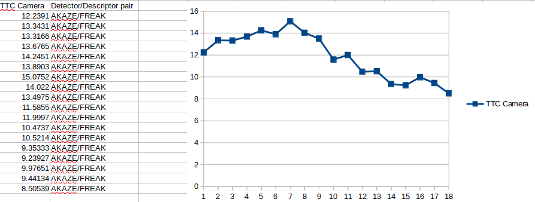

### The Math Behind Time-to-Collision (TTC)

 The velocity $v_0$ or $v_r$ (reference velocity) in the first column is computed from two successive Lidar measurements as follows:

Up to 7th frame it's obvious that the vehicle has a negative acceleration and after that it is positive. This is also noticeable in the TTC camera calculations

## The math behind the TTC Camera detection

A short overview can be found on these pictures regarding the TTC calculation.

There is no distance calculation but the ratio of the height on the image plane or the descriptors. The ratio of all relative distances between each other can be used to compute a reliable TTC estimate by replacing the height ratio $$h_1/h_0$$ with the mean or median of all distance ratios $$d_k/d_k'$$

## Performance Evaluation (TTC Lidar)

| Ref Velocity | TTC Lidar    | Computation Method   |
| ------------ | ------------ | -------------------- |
| 0.640001     | 12.5156      | Median point method  |
| 0.609999     | 12.9722      | Minimum point method |
| 0.630002     | 12.6142      | Median point method  |
| 0.640001     | 12.264       | Minimum point method |
| 0.560002     | 14.091       | Median point method  |
| 0.559998     | 13.9161      | Minimum point method |
| 0.469999     | 16.6894      | Median point method  |
| 1.08         | 7.11572      | Minimum point method |
| 0.494998     | 15.7465      | Median point method  |
| 0.469999     | 16.2511      | Minimum point method |
| 0.604999     | 12.7835      | Median point method  |
| 0.609999     | 12.4213      | Minimum point method |
| 0.640001     | 11.9844      | Median point method  |
| 0.220003     | 34.3404      | Minimum point method |
| 0.580001     | 13.1241      | Median point method  |
| 0.799999     | 9.34376      | Minimum point method |
| 0.580001     | 13.0241      | Median point method  |
| 0.409999     | 18.1318      | Minimum point method |
| 0.669999     | 11.1746      | Median point method  |
| 0.409999     | 18.0318      | Minimum point method |
| 0.580001     | 12.8086      | Median point method  |
| 1.88         | **3.83244**  | Minimum point method |
| 0.819998     | 8.95978      | Median point method  |
| -0.669999    | **-10.8537** | Minimum point method |
| 0.73         | 9.96439      | Median point method  |
| 0.780001     | 9.22307      | Minimum point method |
| 0.750003     | 9.59863      | Median point method  |
| 0.649996     | 10.9678      | Minimum point method |
| 0.834999     | 8.52157      | Median point method  |
| 0.870004     | 8.09422      | Minimum point method |
| 0.740001     | 9.51552      | Median point method  |
| 2.15         | **3.17535**  | Minimum point method |
| 0.725        | 9.61241      | Median point method  |
| -0.689998    | **-9.99424** | Minimum point method |
| 0.819998     | 8.3988       | Median point method  |
| 0.819998     | 8.30978      | Minimum point method |

I calculated the TTC first based on the constant velocity model with the minimum lidar points detected and then proceeded with the median points in the respective bounding boxes. As the bold values indicate, especially the minus ones, the collision should have  already happened in the past, so it's not a feasible solution to consider the minimum values but the median ones.

## Performance Evaluation (TTC Camera)

Among the detectors/descriptor pairs the best performance is achieved using the AKAZE/FREAK.

It's known to yield the best result in high frame rate or high resolution images. Here an indirect supportive article can be found: http://tulipp.eu/wp-content/uploads/2019/03/2017_TUD_HEART_kalms.pdf

As seen above, which is also noticeable in the reference velocity calculations from the lidar measurements, up to 7th frame the vehicle decelerates and then accelerates again. So the constant velocity model is not capable of predicting the outcome of future frames. 
